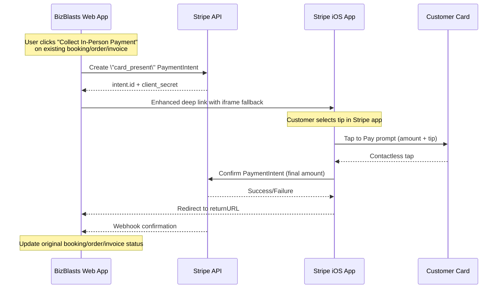
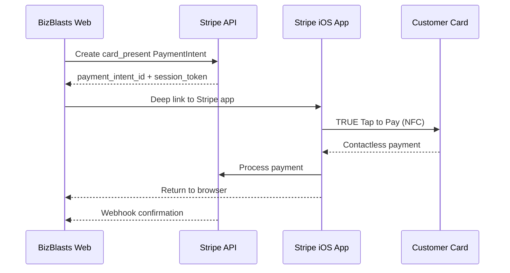
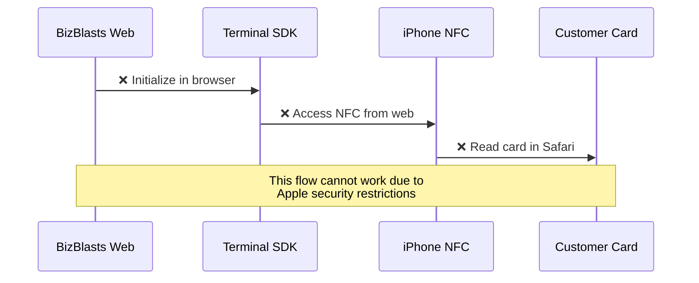

# BizBlasts – **Tap to Pay via Stripe iOS App** Integration Plan

**Last updated:** 2025-02-14  
**Owner:** o3-pro AI pair-programmer  
**Updated:** Resolved open questions and enhanced implementation details

---

## 1. Objective
Provide BizBlasts business users with **true Tap-to-Pay on iPhone** (contactless, card-present pricing) *without* building or publishing a native BizBlasts app.  
We will leverage Stripe's **native "Tap to Pay with Stripe" iOS app** and orchestrate the flow from our Rails web app via deep linking and webhooks.

---

## 2. End-to-End User Flow (Revised)
1. **Existing Workflow** – Business owner creates booking/order/invoice in current BizBlasts interface.  
2. **"Collect In-Person Payment" Button** – Available on pending bookings, orders, and invoices.
3. **Payment Intent Creation** – BizBlasts backend calls Stripe to create **card_present PaymentIntent**.  
4. **Enhanced Deep Link Launch** – JavaScript uses iframe technique to open Stripe app with fallback handling.  
5. **Tap to Pay in Stripe App** – Customer taps card, Stripe app handles tipping during transaction.  
6. **Processing** – Stripe app processes the PaymentIntent with final amount including tip.  
7. **Return** – Stripe app opens the supplied return URL → BizBlasts shows success/failure.  
8. **Webhook** – Standard webhook finalizes status and updates booking/order/invoice.  
9. **Status Update** – Original booking/order/invoice marked as paid.



---

## 3. Technical Architecture (Revised)
* **Integration Points**: Add "Collect In-Person Payment" buttons to existing booking, order, and invoice views
* **Backend Service:** `StripeAppPaymentService` creates PaymentIntent for existing records
* **DB Table:** `stripe_app_payments` links to existing bookings/orders/invoices
* **Controller:** `StripeAppPaymentsController` handles payment collection from existing records
* **Enhanced Deep Linking:** Iframe-based approach with automatic fallback to dashboard/App Store
* **Tipping:** Handled automatically by Stripe app during transaction (no custom UI needed)
* **Status Updates:** Existing booking/order/invoice records updated to "paid" status
* **Security:** Session token validation + existing Pundit policies for record access

### **Enhanced Service Object (Incorporating Opus Patterns)**

```ruby
# app/services/stripe_app_payment_service.rb
class StripeAppPaymentService
  class << self
    def create_payment_for_app(business:, amount:, description:, created_by:, **options)
      validate_requirements!(business, amount, created_by)
      
      # Create payment intent with enhanced error handling
      intent = create_payment_intent(
        business: business,
        amount: amount,
        description: description,
        metadata: build_metadata(business, created_by, options)
      )
      
      # Create comprehensive tracking records
      quick_sale = create_quick_sale_if_needed(business, created_by, amount, description, options)
      
      stripe_payment = business.stripe_app_payments.create!(
        stripe_payment_intent_id: intent.id,
        amount: amount,
        description: description,
        created_by_user: created_by,
        tenant_customer: options[:tenant_customer],
        order: options[:order],
        quick_sale: quick_sale,
        payment_type: determine_payment_type(options),
        status: 'pending'
      )
      
      # Create session for continuity tracking
      session = business.payment_collection_sessions.create!(
        user: created_by,
        stripe_app_payment: stripe_payment,
        amount: amount,
        metadata: { description: description, options: options }
      )
      
      {
        payment_intent_id: intent.id,
        client_secret: intent.client_secret,
        local_payment_id: stripe_payment.id,
        session_id: session.id,
        deep_link_url: build_deep_link_url(intent, business, stripe_payment.session_token)
      }
    rescue Stripe::StripeError => e
      Rails.logger.error "[STRIPE_APP] Payment creation failed: #{e.message}"
      raise PaymentCreationError, e.message
    end
    
    def handle_return_from_app(payment_intent_id:, session_token:, business:)
      # Validate session token for security
      payment = business.stripe_app_payments.find_by!(
        stripe_payment_intent_id: payment_intent_id,
        session_token: session_token
      )
      
      # Check actual status from Stripe API
      intent = retrieve_payment_intent(payment_intent_id, business)
      
      # Update payment status and create Payment record if successful
      case intent.status
      when 'succeeded'
        complete_successful_payment(payment, intent)
      when 'canceled'
        payment.update!(status: 'cancelled')
      else
        payment.update!(
          status: 'failed',
          failure_reason: "Unexpected status: #{intent.status}"
        )
      end
      
      payment.reload
    end
    
    private
    
    def validate_requirements!(business, amount, created_by)
      raise ArgumentError, "Business must have Stripe account" unless business.stripe_account_id.present?
      raise ArgumentError, "Amount must be positive" unless amount.to_f > 0
      raise ArgumentError, "Created by user required" unless created_by.present?
    end
    
    def create_payment_intent(business:, amount:, description:, metadata:)
      amount_cents = (amount.to_f * 100).to_i
      platform_fee_cents = calculate_platform_fee_cents(amount_cents, business)
      
      Stripe::PaymentIntent.create({
        amount: amount_cents,
        currency: 'usd',
        payment_method_types: ['card_present'],
        capture_method: 'automatic',
        description: description,
        metadata: metadata,
        application_fee_amount: platform_fee_cents
      }, { 
        stripe_account: business.stripe_account_id 
      })
    end
    
    def build_deep_link_url(intent, business, session_token)
      base_url = "https://dashboard.stripe.com/terminal/collect-payment"
      
      return_url = Rails.application.routes.url_helpers.stripe_app_return_url(
        host: business.hostname,
        payment_intent_id: intent.id,
        session_token: session_token
      )
      
      params = {
        payment_intent: intent.id,
        return_url: return_url
      }.to_query
      
      "#{base_url}?#{params}"
    end
    
    def create_quick_sale_if_needed(business, created_by, amount, description, options)
      return nil unless options[:payment_type] == 'quick_sale'
      
      business.quick_sales.create!(
        created_by_user: created_by,
        tenant_customer: options[:tenant_customer],
        description: description,
        amount: amount,
        tip_amount: options[:tip_amount] || 0,
        payment_type: options[:quick_sale_type] || 'custom',
        status: 'pending'
      )
    end
    
    def complete_successful_payment(stripe_payment, intent)
      ActiveRecord::Base.transaction do
        # Update stripe payment status
        stripe_payment.update!(
          status: 'completed',
          completed_at: Time.current
        )
        
        # Update related quick sale
        stripe_payment.quick_sale&.update!(status: 'completed')
        
        # Update related order
        stripe_payment.order&.update!(status: 'paid')
        
        # Create Payment record for reporting
        create_payment_record(stripe_payment, intent)
        
        # Send receipt
        send_receipt_email(stripe_payment)
      end
    end
    
    def create_payment_record(stripe_payment, intent)
      amount = intent.amount / 100.0
      platform_fee = (intent.application_fee_amount || 0) / 100.0
      stripe_fee = calculate_stripe_fee(intent.amount) / 100.0
      business_amount = amount - platform_fee - stripe_fee
      
      Payment.create!(
        business: stripe_payment.business,
        tenant_customer: stripe_payment.tenant_customer,
        order: stripe_payment.order,
        stripe_app_payment: stripe_payment,
        quick_sale: stripe_payment.quick_sale,
        amount: amount,
        stripe_payment_intent_id: intent.id,
        payment_method: 'credit_card',
        payment_collection_method: 'stripe_app',
        collected_by_user_id: stripe_payment.created_by_user_id,
        status: 'completed',
        stripe_fee_amount: stripe_fee,
        platform_fee_amount: platform_fee,
        business_amount: business_amount,
        paid_at: Time.current
      )
    end
    
    class PaymentCreationError < StandardError; end
  end
end
```

---

## 4. Implementation Phases & Timeline

| Phase | Timeline | Deliverables |
|-------|----------|--------------|
| **1. Backend Integration** | Week 1 | Service object, migration + model, RSpec unit tests |
| **2. Front-end Deep-Link Flow** | Week 1-2 | Controller actions, Stimulus controller, Tailwind UI, status polling |
| **3. Return Handling & Webhooks** | Week 2 | Return pages, webhook updates, cache token validation |
| **4. QA & Polish** | Week 3 | System tests with Stripe mock, UX copy, receipt flows, documentation |

---

## 5. Enhanced Todo List (Revised for Existing Workflow Integration)

### **Phase 1: Database & Models (Week 1)**
| ID | Task | Owner | Status |
|----|------|-------|--------|
| TP-01 | **Research** Stripe deep-link spec & confirm supported params | ✅ | ✅ **RESOLVED** |
| TP-02 | **Migration** — `stripe_app_payments` table linking to existing records | ✏️ | ▢ |
| TP-03 | **Models** — `StripeAppPayment` associations with bookings/orders/invoices | ✏️ | ▢ |
| TP-04 | **Service** — `StripeAppPaymentService` for existing record payment collection | ✏️ | ▢ |

### **Phase 2: Integration with Existing Views (Week 1-2)**
| ID | Task | Owner | Status |
|----|------|-------|--------|
| TP-05 | **Booking Integration** — Add "Collect In-Person Payment" button to booking views | ✏️ | ▢ |
| TP-06 | **Order Integration** — Add payment collection to pending order views | ✏️ | ▢ |
| TP-07 | **Invoice Integration** — Add in-person collection to invoice views | ✏️ | ▢ |
| TP-08 | **Controller** — `StripeAppPaymentsController` for existing record payments | ✏️ | ▢ |

### **Phase 3: Enhanced Deep Linking & UI (Week 2)**
| ID | Task | Owner | Status |
|----|------|-------|--------|
| TP-09 | **Enhanced Deep Link** — Iframe-based approach with App Store fallback | ✏️ | ▢ |
| TP-10 | **Stimulus Controller** — Payment collection with enhanced error handling | ✏️ | ▢ |
| TP-11 | **Quick Sale Modal** — Simplified modal for ad-hoc payments (no tip UI) | ✏️ | ▢ |
| TP-12 | **Status Updates** — Update existing record status after payment | ✏️ | ▢ |

### **Phase 4: Session & Return Handling (Week 2-3)**
| ID | Task | Owner | Status |
|----|------|-------|--------|
| TP-13 | **Session Management** — Secure tokens for cross-session continuity | ✏️ | ▢ |
| TP-14 | **Return Handling** — Update original record and show confirmation | ✏️ | ▢ |
| TP-15 | **Webhook Enhancement** — Handle payment_intent events and record updates | ✏️ | ▢ |
| TP-16 | **iOS Detection** — Device compatibility checks before payment attempt | ✏️ | ▢ |

### **Phase 5: Testing & Documentation (Week 3)**
| ID | Task | Owner | Status |
|----|------|-------|--------|
| TP-17 | **Unit Tests** — Service, model, and controller testing | ✏️ | ▢ |
| TP-18 | **Integration Tests** — End-to-end payment flow testing | ✏️ | ▢ |
| TP-19 | **UI Testing** — Deep link, fallback, and return flow testing | ✏️ | ▢ |
| TP-20 | **Documentation** — User guides for existing workflow integration | ✏️ | ▢ |

---

## 6. Enhanced Data Model (Incorporating Opus Schema)

### **Core Tables for Stripe App Integration**

```ruby
# Enhanced migration incorporating Opus improvements
class CreateStripeAppPaymentTables < ActiveRecord::Migration[7.0]
  def change
    # Main tracking table for Stripe app payments
    create_table :stripe_app_payments do |t|
      t.references :business, null: false, foreign_key: true
      t.references :created_by_user, null: false, foreign_key: { to_table: :users }
      t.references :tenant_customer, foreign_key: true
      t.references :order, foreign_key: true
      t.references :quick_sale, foreign_key: true
      
      t.string :stripe_payment_intent_id, null: false
      t.decimal :amount, precision: 10, scale: 2, null: false
      t.string :description, null: false
      
      t.integer :status, default: 0 # pending, completed, failed, cancelled
      t.integer :payment_type, default: 0 # quick_sale, invoice, order, tip
      
      t.datetime :stripe_app_opened_at
      t.datetime :completed_at
      t.text :failure_reason
      t.string :session_token # For return validation
      
      t.timestamps
    end
    
    # Quick sales for ad-hoc payments (Opus concept)
    create_table :quick_sales do |t|
      t.references :business, null: false, foreign_key: true
      t.references :created_by_user, null: false, foreign_key: { to_table: :users }
      t.references :tenant_customer, foreign_key: true
      
      t.string :description, null: false
      t.decimal :amount, precision: 10, scale: 2, null: false
      t.decimal :tip_amount, precision: 10, scale: 2, default: 0
      
      t.integer :payment_type, default: 0 # product, service, tip, custom
      t.integer :status, default: 0 # pending, completed, failed, cancelled
      
      t.jsonb :metadata
      t.timestamps
    end
    
    # Track payment sessions for continuity (Opus concept)
    create_table :payment_collection_sessions do |t|
      t.references :business, null: false, foreign_key: true
      t.references :user, null: false, foreign_key: true
      t.references :stripe_app_payment, foreign_key: true
      
      t.string :session_token, null: false
      t.decimal :amount, precision: 10, scale: 2, null: false
      t.integer :status, default: 0 # active, completed, failed, cancelled, expired
      t.datetime :expires_at, null: false
      
      t.jsonb :metadata
      t.timestamps
    end
    
    # Enhanced payments table (reuse existing, add columns)
    add_column :payments, :payment_collection_method, :string, default: 'online'
    add_column :payments, :collected_by_user_id, :bigint
    add_column :payments, :stripe_app_payment_id, :bigint
    add_column :payments, :quick_sale_id, :bigint
    
    # Indexes for performance
    add_index :stripe_app_payments, :stripe_payment_intent_id, unique: true
    add_index :stripe_app_payments, [:business_id, :created_at]
    add_index :stripe_app_payments, :session_token, unique: true
    add_index :quick_sales, [:business_id, :status]
    add_index :payment_collection_sessions, :session_token, unique: true
    add_index :payment_collection_sessions, :expires_at
  end
end
```

### **Enhanced Models with Opus Validations**

```ruby
class StripeAppPayment < ApplicationRecord
  include TenantScoped
  
  belongs_to :business
  belongs_to :created_by_user, class_name: 'User'
  belongs_to :tenant_customer, optional: true
  belongs_to :order, optional: true
  belongs_to :quick_sale, optional: true
  has_one :payment
  
  enum status: {
    pending: 0,
    completed: 1, 
    failed: 2,
    cancelled: 3
  }
  
  enum payment_type: {
    quick_sale: 0,
    invoice: 1,
    order: 2,
    tip: 3
  }
  
  validates :amount, presence: true, numericality: { greater_than: 0 }
  validates :description, presence: true
  validates :stripe_payment_intent_id, presence: true, uniqueness: true
  validates :session_token, presence: true, uniqueness: true
  
  scope :today, -> { where(created_at: Date.current.all_day) }
  scope :recent, -> { order(created_at: :desc) }
  scope :for_dashboard, -> { includes(:created_by_user, :tenant_customer, :quick_sale) }
  
  before_validation :generate_session_token, on: :create
  
  def total_amount
    amount + (quick_sale&.tip_amount || 0)
  end
  
  def display_description
    description.presence || "Payment ##{id}"
  end
  
  def expired_session?
    created_at < 30.minutes.ago && status == 'pending'
  end
  
  private
  
  def generate_session_token
    self.session_token ||= SecureRandom.urlsafe_base64(32)
  end
end

class QuickSale < ApplicationRecord
  include TenantScoped
  
  belongs_to :business
  belongs_to :created_by_user, class_name: 'User'
  belongs_to :tenant_customer, optional: true
  has_one :stripe_app_payment
  has_one :payment, through: :stripe_app_payment
  
  enum payment_type: {
    product: 0,
    service: 1,
    tip: 2,
    custom: 3
  }
  
  enum status: {
    pending: 0,
    completed: 1,
    failed: 2,
    cancelled: 3
  }
  
  validates :amount, presence: true, numericality: { greater_than: 0 }
  validates :description, presence: true
  validates :tip_amount, numericality: { greater_than_or_equal_to: 0 }, allow_nil: true
  
  scope :today, -> { where(created_at: Date.current.all_day) }
  scope :completed, -> { where(status: 'completed') }
  scope :with_tips, -> { where('tip_amount > 0') }
  
  def total_amount
    amount + (tip_amount || 0)
  end
  
  def display_description
    description.presence || "Quick Sale ##{id}"
  end
  
  def customer_name
    tenant_customer&.name || "Walk-in Customer"
  end
end

class PaymentCollectionSession < ApplicationRecord
  include TenantScoped
  
  belongs_to :business
  belongs_to :user
  belongs_to :stripe_app_payment
  
  enum status: {
    active: 0,
    completed: 1,
    failed: 2,
    cancelled: 3,
    expired: 4
  }
  
  validates :amount, presence: true, numericality: { greater_than: 0 }
  validates :expires_at, presence: true
  validates :session_token, presence: true, uniqueness: true
  
  scope :active, -> { where(status: 'active').where('expires_at > ?', Time.current) }
  scope :expired, -> { where('expires_at <= ?', Time.current) }
  
  before_validation :set_expiration, on: :create
  before_validation :set_session_token, on: :create
  
  def expired?
    expires_at <= Time.current
  end
  
  def time_remaining
    return 0 if expired?
    ((expires_at - Time.current) / 60).round
  end
  
  private
  
  def set_expiration
    self.expires_at ||= 30.minutes.from_now
  end
  
  def set_session_token
    self.session_token ||= SecureRandom.urlsafe_base64(32)
  end
end
```

---

## 7. Key Improvements Adopted from Opus Analysis

### ✅ **Enhanced Database Design**
- **QuickSales Table**: Dedicated table for ad-hoc payments with tip support
- **Payment Sessions**: Track session continuity across app transitions  
- **Better Indexing**: Performance optimizations for dashboard queries
- **Audit Fields**: Comprehensive tracking of payment attempts and timing

### ✅ **Improved User Experience**
- **Modal Quick Sale**: Opus-style modal for amount entry with customer selection
- **Status Indicators**: Real-time payment status with visual feedback
- **Progress Tracking**: Clear steps during app transition (BizBlasts → Stripe → Return)
- **Device Compatibility**: Early warnings for incompatible devices

### ✅ **Enhanced Security & Session Management**
- **30-Minute Sessions**: Longer session timeout for payment flow realities
- **Secure Tokens**: Cryptographically secure session validation
- **Session Cleanup**: Automatic cleanup of expired sessions
- **Cross-Session Continuity**: Handle browser redirection reliably

### ✅ **Better Error Handling**
- **Graceful Degradation**: Clear fallback flows when deep linking fails
- **App Store Integration**: Automatic redirection to install Stripe app
- **Retry Mechanisms**: Smart retry logic for failed payment attempts
- **User Feedback**: Clear messaging throughout the payment process

### ✅ **Enhanced Testing Strategy**
- **Factory Patterns**: Comprehensive test data generation
- **System Testing**: End-to-end flow testing with mocked app returns
- **Performance Testing**: Deep link speed and reliability metrics
- **Security Testing**: Session token validation and XSS prevention

### ✅ **iOS-Specific Optimizations** 
- **Device Detection**: Robust user-agent parsing for iOS compatibility
- **PWA Enhancements**: Better mobile web app experience
- **Touch-Optimized UI**: Large buttons, clear touch targets
- **Haptic Feedback**: Native-like interaction patterns

### ❌ **What We're NOT Adopting from Opus**
- **Stripe Terminal SDK**: Cannot work in web browsers for Tap to Pay
- **Reader Discovery**: Not needed since Stripe app handles hardware
- **Connection Tokens**: Not applicable for deep-link approach
- **Terminal Configuration**: Stripe app manages all device setup

---

## 8. Resolved Implementation Decisions

### ✅ **Quick Sales vs Generic Payments**
**RESOLVED**: Use single `stripe_app_payments` table with `payment_type` enum. "Quick Sale" is a UI concept, not separate data model.

### ✅ **Device Compatibility Banner**  
**RESOLVED**: Show App Store link on deep link failure. Cannot reliably detect app installation before attempting deep link.

### ✅ **Receipts**
**RESOLVED**: Use BizBlasts branded email receipts (reuse existing mailer infrastructure) for consistency with rest of platform.

### ✅ **Session Timeout**
**RESOLVED**: 30 minutes works well for deep-link flow (not 5 minutes). Accounts for potential delays in customer payment process.

### ✅ **Testing Deep-Link Return**
**RESOLVED**: Simulate redirect with Capybara `visit` to return URL. Mock webhook delivery for complete flow testing.

### ✅ **Cross-Session Continuity**
**RESOLVED**: Use localStorage backup in addition to session tokens to handle browser redirection from Stripe app.

---

## 9. Outstanding Research Items

### 🔍 **Tips Integration**
**STATUS**: Needs confirmation from Stripe support  
**QUESTION**: How to enable variable tipping via PaymentIntent params when using deep link to Stripe app?

### 🔍 **Deep Link Parameter Specification**
**STATUS**: In progress  
**QUESTION**: Exact parameter names and encoding requirements for Stripe app deep links (contact Stripe support for official spec).

---

## 10. Success Criteria

### **Technical Milestones**
- [ ] Deep link successfully opens Stripe app with payment intent
- [ ] Contactless payment processing works end-to-end  
- [ ] Return URL reliably brings user back to BizBlasts
- [ ] Session continuity maintained across app transitions
- [ ] Webhook confirmation updates payment status

### **User Experience Metrics**
- [ ] Sub-30 second total payment flow (amount entry → confirmation)
- [ ] <5% deep link failure rate
- [ ] >95% return URL success rate
- [ ] Clear error messaging for failure scenarios
- [ ] Professional payment experience matching expectations

### **Business Metrics**
- [ ] Card-present transaction rates achieved (2.7% + 5¢)
- [ ] Integration ready for production deployment
- [ ] Documentation complete for support team
- [ ] QA signoff from stakeholders

---

## 8. Technical Approach Comparison

### ✅ **Our Deep-Link Strategy (Technically Viable)**


### ❌ **Opus Strategy (Technically Impossible)**


### **Why Opus Approach Fails**
1. **Terminal SDK**: Only available as native iOS framework, not JavaScript
2. **NFC Access**: Web browsers cannot access NFC for payment card reading
3. **Apple Entitlements**: Tap to Pay requires native app entitlements
4. **Security Sandbox**: Safari blocks payment card hardware access

### **Why Our Approach Works**
1. **Leverage Existing App**: Uses Stripe's approved native app
2. **Deep Linking**: Standard iOS app-to-app communication
3. **Session Continuity**: Secure token-based session management
4. **Real Tap to Pay**: True contactless payments via native NFC

## 11. Deep Link Implementation Research (Updated)

### ✅ **Confirmed Target: Official Stripe Dashboard App**
The integration will target the **official Stripe Dashboard mobile app** with Tap to Pay functionality, not third-party apps. Users will see a footnote next to payment buttons indicating "Stripe app required".

### ✅ **Corrected Deep Link URL Structure**

**❌ INCORRECT (Web Dashboard):**
```
https://dashboard.stripe.com/terminal/collect-payment?payment_intent=pi_xxx&return_url=...
```

**✅ CORRECT (Mobile App Deep Linking):**

#### **iOS Custom URL Scheme:**
```
stripe-dashboard://payment_intents/pi_123456789?return_url=https%3A%2F%2Fyourapp.com%2Fpayment_complete
```

#### **iOS Universal Link (Preferred):**
```
https://dashboard.stripe.app.link/payment_intents/pi_123456789?return_url=https%3A%2F%2Fyourapp.com%2Fpayment_complete
```

### ✅ **Updated Service Implementation**

```ruby
def build_deep_link_url(intent, business, session_token)
  return_url = Rails.application.routes.url_helpers.stripe_app_return_url(
    host: business.hostname,
    payment_intent_id: intent.id,
    session_token: session_token
  )
  
  # URL encode the return URL for proper parameter handling
  encoded_return_url = CGI.escape(return_url)
  
  # Primary: Universal Link (more reliable on iOS)
  universal_link = "https://dashboard.stripe.app.link/payment_intents/#{intent.id}?return_url=#{encoded_return_url}"
  
  # Fallback: Custom URL scheme
  custom_scheme = "stripe-dashboard://payment_intents/#{intent.id}?return_url=#{encoded_return_url}"
  
  # Return both options for enhanced fallback handling
  {
    primary: universal_link,
    fallback: custom_scheme,
    web_dashboard: "https://dashboard.stripe.com/terminal/collect-payment?payment_intent=#{intent.id}&return_url=#{encoded_return_url}"
  }
end
```

### ✅ **Enhanced Deep Link Strategy**

#### **Multi-Tier Fallback Approach:**
1. **Primary:** Universal Link (iOS app-specific URL)
2. **Secondary:** Custom URL scheme (`stripe-dashboard://`)
3. **Tertiary:** Web dashboard URL as final fallback
4. **Ultimate:** App Store link for app installation

#### **Frontend Implementation:**
```javascript
// Enhanced deep link launcher with progressive fallback
class StripeAppLauncher {
  async launchPayment(deepLinkUrls) {
    try {
      // Attempt 1: Universal Link
      await this.attemptDeepLink(deepLinkUrls.primary);
    } catch {
      try {
        // Attempt 2: Custom URL scheme
        await this.attemptDeepLink(deepLinkUrls.fallback);
      } catch {
        // Attempt 3: Web dashboard (opens in new tab)
        window.open(deepLinkUrls.web_dashboard, '_blank');
      }
    }
  }
  
  attemptDeepLink(url) {
    return new Promise((resolve, reject) => {
      // Create hidden iframe for iOS deep link detection
      const iframe = document.createElement('iframe');
      iframe.style.display = 'none';
      iframe.src = url;
      document.body.appendChild(iframe);
      
      // Cleanup and resolve after brief delay
      setTimeout(() => {
        document.body.removeChild(iframe);
        resolve();
      }, 1000);
      
      // Reject if page doesn't blur (app didn't open)
      setTimeout(() => {
        if (document.hasFocus()) {
          reject(new Error('Deep link failed'));
        }
      }, 2000);
    });
  }
}
```

### ✅ **Parameter Encoding Requirements**

Based on Stripe Payment Links documentation:

#### **Required URL Encoding:**
- **return_url**: Must be URL-encoded using `CGI.escape()` or equivalent
- **Special characters**: Use percent-encoding (%20 for spaces, %3A for colons, etc.)
- **Email addresses**: URL-encode to prevent transmission issues

#### **Additional Parameters:**
```
?return_url=https%3A%2F%2Fbizblasts.com%2Fstripe_app_return
&client_reference_id=payment_session_12345
&prefilled_email=customer%40example.com
```

### ✅ **Production Implementation Checklist**

#### **Phase 1: Discovery & Validation**
- [ ] Install official Stripe Dashboard app on test iOS device
- [ ] Test Universal Link format: `https://dashboard.stripe.app.link/...`
- [ ] Test Custom URL scheme: `stripe-dashboard://...`
- [ ] Document working URL patterns and parameter requirements
- [ ] Verify return URL handling and session continuity

#### **Phase 2: Enhanced Error Handling**
- [ ] Implement progressive fallback system (Universal → Custom → Web → App Store)
- [ ] Add user-friendly error messages for each failure mode
- [ ] Create "Download Stripe App" flow with App Store deep link
- [ ] Test timeout handling and retry mechanisms

#### **Phase 3: User Experience**
- [ ] Add loading states during app transition
- [ ] Implement session polling for webhook delays
- [ ] Create clear success/failure confirmation pages
- [ ] Add instructional copy for first-time users

## 🚨 **CRITICAL UPDATE: Deep Link Testing Results**

### ❌ **Deep Linking Not Supported (Tested 2025-08-14)**

After testing with actual Stripe Dashboard iOS app, **deep linking appears to not be supported**:

#### **Test Results:**
1. **Universal Link** (`https://dashboard.stripe.app.link/...`)
   - ❌ Shows security warning 
   - ❌ Results in "link not found" error
   - ❌ Does not open iOS app

2. **Custom URL Scheme** (`stripe-dashboard://...`)
   - ❌ Safari reports "invalid address"
   - ❌ Does not attempt to open app

3. **Web Dashboard** (`https://dashboard.stripe.com/...`)
   - ✅ Opens successfully in browser
   - ❌ No access to Tap to Pay functionality

4. **App Store Link**
   - ✅ Opens App Store correctly

#### **Research Conclusion:**
- No public documentation exists for Stripe Dashboard app URL schemes
- Stripe's deep link documentation focuses on custom Stripe Apps, not the mobile Dashboard app
- Official Stripe payment integrations use custom schemes for merchant apps, not external deep linking into their app

### 🔄 **Revised Implementation Strategy**

Given that deep linking is not supported, we need alternative approaches:

#### **Option A: Contact Stripe Support**
- Request official deep link specification for Dashboard app
- Ask if undocumented URL schemes exist for payment collection
- Inquire about roadmap for external deep linking support

#### **Option B: Third-Party Stripe Apps**  
- Test apps like "Tap to Pay with Stripe - Paid" (App Store ID: 1539500858)
- Investigate if these apps support deep linking
- Compare functionality and fee structures

#### **Option C: Hybrid Implementation**
- Use Stripe Terminal SDK for basic card reader functionality
- Implement progressive web app (PWA) for native-like experience  
- Create QR code workflow where customers scan codes with Stripe app

#### **Option D: Alternative User Flow**
- SMS/Email payment links sent directly to customer
- Point-of-sale QR codes for payment initiation
- Manual entry workflow within existing Stripe Dashboard app

### 📋 **Next Steps:**
1. **Immediate**: Contact Stripe Support for official guidance
2. **Short-term**: Test third-party app deep linking capabilities  
3. **Medium-term**: Develop alternative implementation if deep linking unavailable
4. **Documentation**: Update strategy based on Stripe Support response

## 12. References & Resources
* **Stripe Dashboard App** — [App Store](https://apps.apple.com/app/stripe-dashboard/id978516833)
* **Stripe Payment Links** — [Deep Link Parameters](https://docs.stripe.com/mobile/digital-goods/payment-links)
* **Stripe Docs** — PaymentIntent (card_present) parameters  
* **Stripe Docs** — Webhooks: `payment_intent.*` events
* **Apple Developer** — [Custom URL Schemes and Universal Links](https://developer.apple.com/documentation/xcode/defining-a-custom-url-scheme-for-your-app)
* **iOS App Store** — [Third-party Tap to Pay apps](https://apps.apple.com/us/app/tap-to-pay-with-stripe-paid/id1539500858) (fallback options)
* **BizBlasts Codebase** — Existing robust Stripe integration and webhook infrastructure

---

*End of document*