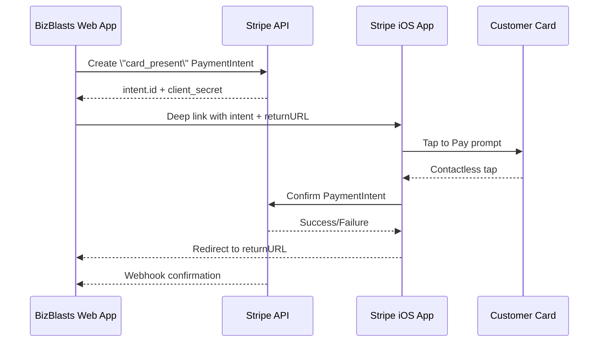

# BizBlasts – **Tap to Pay via Stripe iOS App** Integration Plan

**Last updated:** 2025-02-14  
**Owner:** o3-pro AI pair-programmer

---

## 1. Objective
Provide BizBlasts business users with **true Tap-to-Pay on iPhone** (contactless, card-present pricing) *without* building or publishing a native BizBlasts app.  
We will leverage Stripe’s **native "Tap to Pay with Stripe" iOS app** and orchestrate the flow from our Rails web app via deep linking and webhooks.

---

## 2. End-to-End User Flow
1. **Amount Entry** – Business owner opens BizBlasts in Safari → enters amount & description.  
2. **Payment Intent Creation** – BizBlasts backend calls Stripe to create a **card_present PaymentIntent** (connected account).  
3. **Deep Link Launch** – BizBlasts generates a deep-link URL and redirects to the **Stripe iOS app**, passing the PaymentIntent & return URL.  
4. **Tap to Pay** – In Stripe app, customer taps card on business owner’s iPhone.  
5. **Processing** – Stripe app processes the PaymentIntent.  
6. **Return** – Stripe app opens the supplied return URL → BizBlasts shows success/failure.  
7. **Webhook** – Standard webhook finalises status in case of delayed confirmation.  
8. **Receipt** – BizBlasts offers email/SMS receipt & records revenue.

A sequence diagram is embedded for clarity.

---

## 3. Technical Architecture
* **Backend Service:** `StripeAppPaymentService` (new) encapsulates PaymentIntent creation & deep-link generation.
* **DB Table:** `stripe_app_payments` tracks each in-person payment (status, amount, intent_id, etc.).
* **Controller:** `BusinessManager::StripeAppPaymentsController` handles create, return callback & status polling.
* **Stimulus Controller:** `stripe_app_payment_controller.js` manages UI hand-off, deep-link, status polling, and fallbacks.
* **Security:**
  * Session token cached & validated on return.
  * Pundit policies for multi-tenant isolation.
* **Webhooks:** Extend existing Stripe webhook handler for `payment_intent.succeeded` on card_present intents.

---

## 4. Implementation Phases & Timeline

| Phase | Timeline | Deliverables |
|-------|----------|--------------|
| **1. Backend Integration** | Week 1 | Service object, migration + model, RSpec unit tests |
| **2. Front-end Deep-Link Flow** | Week 1-2 | Controller actions, Stimulus controller, Tailwind UI, status polling |
| **3. Return Handling & Webhooks** | Week 2 | Return pages, webhook updates, cache token validation |
| **4. QA & Polish** | Week 3 | System tests with Stripe mock, UX copy, receipt flows, documentation |

---

## 5. Detailed Todo List (Phase 1 & 2)

| ID | Task | Owner | Status |
|----|------|-------|--------|
| TP-01 | **Research** Stripe deep-link spec & confirm supported params | ✏️ | ▢ |
| TP-02 | Migration – `stripe_app_payments` table **(+ quick_sales?\*)** | ✏️ | ▢ |
| TP-03 | Model – `StripeAppPayment` with enum status **(+ `QuickSale` model if adopted)** | ✏️ | ▢ |
| TP-04 | Service – `StripeAppPaymentService.create_payment_for_app` | ✏️ | ▢ |
| TP-05 | Controller – `StripeAppPaymentsController#create` | ✏️ | ▢ |
| TP-06 | Deep-link builder util + session token cache | ✏️ | ▢ |
| TP-07 | Return callback action + views (success/failed/cancelled) | ✏️ | ▢ |
| TP-08 | Stimulus `stripe_app_payment_controller.js` | ✏️ | ▢ |
| TP-09 | Tailwind UI components & instructions **(consider adopting the “Quick Sale” modal design from opus)** | ✏️ | ▢ |
| TP-10 | Webhook handler update (`payment_intent.succeeded/canceled`) | ✏️ | ▢ |
| TP-11 | RSpec unit tests (service, model, controller) **+ system spec for Quick Sale** | ✏️ | ▢ |
| TP-12 | System spec – deep-link happy path (mock return + webhook) | ✏️ | ▢ |
| TP-13 | Documentation update (README + Help Center) | ✏️ | ▢ |
| TP-14 | Stakeholder UAT & fee-structure review | ✏️ | ▢ |

> \* **Quick Sales?** Opus suggests a lightweight `quick_sales` table to record ad-hoc in-person charges. This pairs nicely with our deep-link flow and will be evaluated during TP-02/03.

---

## 6. Borrowed Enhancements from Opus Plan
The PWA/Terminal blueprint contains generic improvements we’ll reuse:

1. **Quick Sale Concept** – Simple modal to enter amount/description + optional tip; greatly streamlines on-the-spot charges.
2. **Comprehensive DB Tracking** – Status enums (`pending/completed/failed/cancelled`) & audit fields will be mirrored in `stripe_app_payments` (and `quick_sales` if adopted).
3. **Security Controls** – 5-minute session expiry and audit logging ideas ported into our session-token cache & webhook validation.
4. **Testing Checklist** – We’ll adopt Opus’s phased RSpec/system test approach and add mocks for deep-link redirect plus webhook confirmation.
5. **iOS Capability Detection** – The user-agent parsing helpers from the Opus `DashboardController` will be refactored for our flow to display an early warning if device is incompatible with Stripe app.
6. **PWA Niceties** (optional) – Meta tags (`apple-mobile-web-app-capable`, viewport) can improve the full-screen experience when BizBlasts is saved to home-screen.

Items that rely on Stripe Terminal SDK (reader discovery, connection tokens, etc.) **will NOT be implemented** since the Stripe iOS app handles hardware interaction.

---

## 7. Open Questions (Updated)
1. **Quick Sales vs Generic Payments** – Should we persist ad-hoc payments in a separate table (`quick_sales`) or store everything in `stripe_app_payments`?  
2. **Device Compatibility Banner** – Show warning if Stripe app not installed? (Cannot detect reliably before deep-link, but we can offer App Store link on failure.)
3. **Receipts** – Use BizBlasts branded email (reuse Opus mailer idea) or rely on Stripe app’s built-in receipt screen?
4. **Tips** – Stripe app supports variable-amount tipping; confirm how to enable via PaymentIntent params.
5. **Session Timeout** – Opus recommends 5-minute session; adequate for deep-link flow?
6. **Testing Deep-Link Return** – Best strategy to automate? Possibly simulate redirect with Capybara `visit`.

---

## 7. References & Resources
* Stripe Docs – Tap to Pay with Stripe App (contact support for deep-link spec)
* Stripe Docs – PaymentIntent (card_present) parameters
* Stripe Docs – Webhooks: `payment_intent.*` events
* App Store – [Tap to Pay with Stripe](https://apps.apple.com/us/app/tap-to-pay-with-stripe/id1539500858)

---

*End of document*
